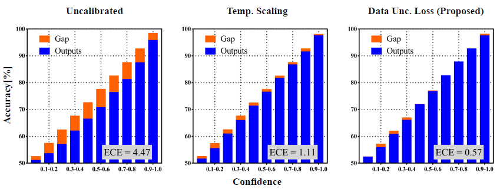

# A Confidence-Calibrated MOBA Game Winner Predictor

This is offcial pytorch implemenation of "A Confidence-Calibrated MOBA Game Winner Predictor".

Proceeding at Conference on Games(CoG) 2020.

## Requirements

1. Pytorch
2. [Cassiopeia](https://github.com/meraki-analytics/cassiopeia)
3. Numpy
4. Pandas
5. Argparse

## How to use

### Collecting match data
1. Register your project and get riot API key at [Riot Developer Portal](https://developer.riotgames.com/docs/portal)
2. Choose your patch version, region, and tier to collect match data and modify `getMatchData.py`. 
3. Run `getMatchData.py`.
4. Collecting data may need few days(can be week!) because access to LoL API server is limited as 100 times per 2 minutes.

### Training Neural Network
1. Move csv files to `./LOLData`.
2. To train plain network:
```bash
python main.py --embed_type='one_hot' --in_game=True --uncertainty='None'
```
To train Data Uncertainy loss function:
```bash
python main.py --embed_type='one_hot' --in_game=True --uncertainty='Data'
```

### Result
